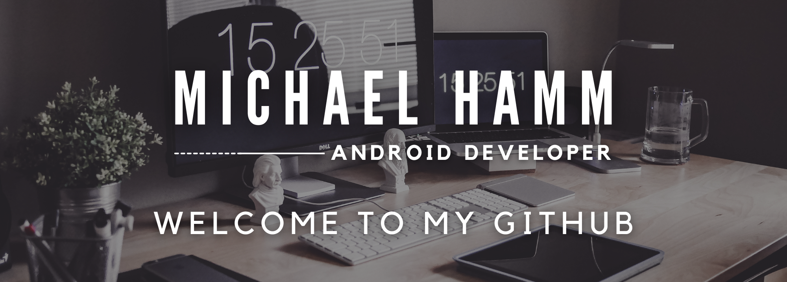

  

#### I'm an Android Developer with a Bachelor's of Science from Boston University (BU). I'm passionate about all things Android and love cretaing things that people can hold in their hands and use every day!

## Operating Systems

## Languages
 

---
- Currently open to new opportunities
- Have built customer facing components that have helped drive significant incremental revenue on both the [Ruelala](https://play.google.com/store/apps/details?id=com.retailconvergence.ruelala) & [Gilt](https://play.google.com/store/apps/details?id=com.gilt.android) Applications while working as an Android Engineer at Rue Gilt Groupe
- 📫 How to reach me: mjhamm@bu.edu or through <a href="www.linkedin.com/in/michael-hamm-001"/>LinkedIn</a>

Interested in where I've been? <a href="./Resume-Michael-Hamm.pdf">My Resume</a>

<!---
mjhamm/mjhamm is a ✨ special ✨ repository because its `README.md` (this file) appears on your GitHub profile.
You can click the Preview link to take a look at your changes.
--->
